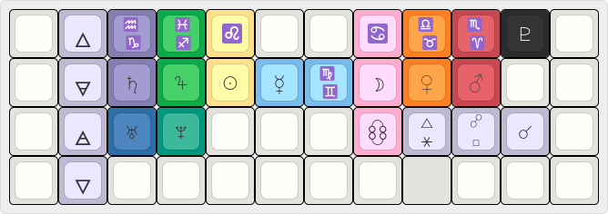

# actual astrolokeys

sailorhg and Cassidoo's [keycaps](https://astrolokeys.com/) got me into
mechanical keyboards in the first place, and it was only when showing off my
Planck to a new astrologer friend that it occured to me to make a functional
astrologers' keyboard. This is a QMK unicode map pedantically dictated by
Hellenstic astrological concepts like essential dignity.

I imagine the Venn diagram of QMK users and astrologers is very slim, since I
can't imagine an astrologer dropping $200 on a custom keyboard if they don't
already dabble in the hobby. If anything, this is a thema mundi study tool for
anyone who likes C, so if you're in that demographic, we should start a Discord
server.

The repo's main event is `unicodemap.c`, a modular hunk of code for you to throw
into your keymap and arrange how you wish. However, I stand by my layout, which
I think is perfectly adaptable to a more standard, staggered board.

- The home row is the seven classical planets divided by
    [sect](https://www.youtube.com/watch?v=1XfPLTQuB9MP), with Mercury in the
    middle (between realms).
- The signs all take up the first row above their rulers, `Shift` to access
    the signs later in the zodiac.
- Logically, the lunar nodes are right below the moon. Per evolutionary
    astrology, you have to work to get the north node.
- The outer planets are no more than 2 keys from their modern domiciles.
    - Pluto is next to the Aries/Scorpio key, aka QWERTY "P" for unintended
        pneumoic ease;
    - Uranus and Neptune are next to each other under Saturn (Aquarius) and
        Jupiter (Pisces) for my agenda even greater than astrological tradition
        (lesbianism).
- The five major aspects occupy `, . /` or `< > ?`, which just makes me happy in
    terms of punctuation. Shift to acess the larger angles.
- Big nerd `enum` table bonus: the planets' aliases are their metals in alchemy.
- Threw in the classical elements' alchemical symbols for fun,  since the
    Planck's 4x12 grid is numerological.

## QMK docs

- [Unicode Support](https://docs.qmk.fm/#/feature_unicode): explains the
    contents of `config.h` and `rules.mk`.
- [QMK CLI](https://github.com/qmk/qmk_cli): the QMK Configurator is more
    trouble than it's worth if you're mostly using custom keycodes. I have an
    easier time using it on MacOS than Linux. 
