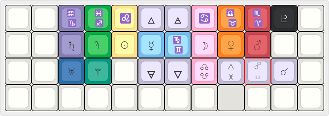

# actual astrolokeys

    
     
    <caption>colors purely illustrative ok</caption>

[sailorhg and Cassidoo's keycaps](https://astrolokeys.com/) got me into mechanical keyboards in the first place, and it was only when showing off my astrolokey'd Planck to a new astrologer friend that it occured to me to make something for our incredibly specific use case. This repo's core is `unicodemap.c`, a modular hunk of code for you to throw in front of your keymap and arrange how you wish. However, I stand by my pedantic layout informed by the Hellenstic [thema mundi](https://upload.wikimedia.org/wikipedia/commons/7/74/Thema_Mundi.svg)! I think you can easily adapt it to a more standard board with staggered rows.

- The home row is the seven classical planets [divided by sect](https://www.youtube.com/watch?v=1XfPLTQuB9MP), with Mercury ☿ and its domiciles in the middle (between realms).
- The signs all take up the first row above their rulers. `Shift` to access the signs later in the zodiac.
- Logically, the lunar nodes are right below the moon. Per evolutionary astrology, you have to work to get the north node.
- The outer planets are no more than 2 keys from their modern domiciles.
    - Pluto ♇ is next to the Aries/Scorpio key, aka QWERTY "P" for unintended mnemonic ease;
    - Uranus ♄ and Neptune ♅ are next to each other under Saturn ♄ (Aquarius) and Jupiter ♃ (Pisces) for my agenda even greater than astrological tradition (lesbianism 🗡🪞🎻🏎).
- The five major aspects occupy `, . /` or `< > ?`, which just makes me happy in terms of punctuation. `Shift` to acess the larger angles. So far, the only problem character in terms of being unsupported by mainstream fonts is sextile ⚹, which I barely use anyway.
- Big nerd `enum` table bonus: the planets' aliases are their metals in alchemy!
- Threw in the classical elements' alchemical symbols for fun! A 4x12 grid feels very mystical, at least in Western cosmologies.

    

## Use

I assume you're using [qmk-cli](https://github.com/qmk/qmk_cli) since the configurator is more of a hindrance when dealing with any number of custom keycodes, and set up your environment appropriately. See [the docs](https://docs.qmk.fm/#/newbs_getting_started) if not!

### Modular

Copy `unicodemap.c` into the top of your keymap. I've had luck keeping it between all my `#define`s and the layout itself. Add or remove or ignore anything! If you use asteroids or minor angles, those are pretty much all in block [U+2600](https://www.compart.com/en/unicode/block/U+2600). 

### just lifting the example map [PLANCK REV7 ONLY]

First, look at `keymap.c` and make sure you actually want it, or edit as you see fit. It's pretty close to the first three layers of the default, with the addition of a numpad (useful since astrology is math) and vi-style navigation. I use what would be the right alt key as a momentary layer toggle. 

1. Save the whole folder `planck-rev7` to your local `qmk_firmware` dev branch: `qmk_firmware/keyboards/planck/rev7/keymaps`. I would rename it something else to avoid redundancy, like `astrolokeys` or `astrokeys`.
    * The only edit you may need to do is in `config.h`: defining [your input method](https://docs.qmk.fm/#/feature_unicode?id=input-modes) based on what OS(es) you use.
2. Run `qmk compile -kb planck/rev7 -km [KEYMAP NAME]`. This should write a `.bin` file straight to `qmk_firmware`.
3. Put your Planck in bootloader mode, then run `qmk flash -kb planck/rev7 -km [KEYMAP NAME]`.
4. On macOS: Go to System Preferences > Keyboard > Input Sources and add (+) Unicode Hex Input.